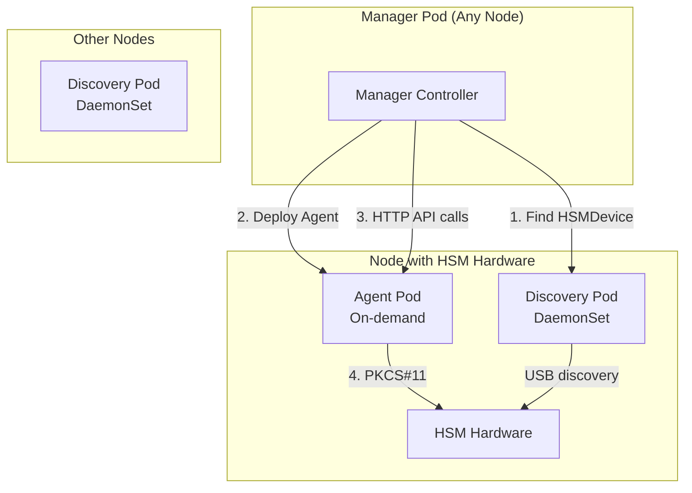

# HSM Agent Pod Architecture

This directory contains examples of how the HSM agent pod system works for distributed HSM operations.

## Architecture Overview

The HSM Secrets Operator now uses a **3-binary architecture**:

1. **Manager** (`/manager`) - Main operator that orchestrates everything
2. **Discovery** (`/discovery`) - Lightweight USB device discovery (DaemonSet)  
3. **Agent** (`/agent`) - HSM operation execution pods (deployed on-demand)

## How It Works

## Process Flow

1. **HSMSecret Created**: User creates an HSMSecret resource
2. **Device Discovery**: Manager finds available HSMDevice (discovered by DaemonSet)
3. **Agent Deployment**: Manager deploys HSM agent pod on node with hardware
4. **Node Affinity**: Agent pod pinned to specific node via `kubernetes.io/hostname`
5. **HTTP Communication**: Manager makes HTTP calls to agent for HSM operations
6. **Hardware Access**: Agent executes PKCS#11 operations locally on HSM

## Key Benefits

✅ **Remote Execution**: Manager can be anywhere, agents run where hardware exists
✅ **Resource Efficiency**: Agents only deployed when HSMSecrets exist
✅ **Auto-cleanup**: Agents removed when no longer needed  
✅ **Node Targeting**: Perfect placement via HSMDevice discovery
✅ **Clean Architecture**: Each component has single responsibility

## Example Deployment

See `agent-example.yaml` for a complete example of:
- HSMDevice discovery configuration  
- HSMSecret that triggers agent deployment
- Secret with PIN configuration

## Agent Pod Configuration

Agent pods are automatically configured with:
- **Environment Variables**: PKCS#11 library path, slot ID, token label
- **Secrets**: PIN from Kubernetes Secret reference  
- **Node Affinity**: Pinned to node with actual hardware
- **Security**: Non-privileged execution with proper security contexts
- **Health Checks**: Liveness and readiness probes
- **Resources**: CPU/memory limits and requests

## API Endpoints

Each agent exposes:
- `GET /api/v1/hsm/info` - HSM device information
- `GET /api/v1/hsm/secrets/{path}` - Read secret
- `POST /api/v1/hsm/secrets/{path}` - Write secret  
- `DELETE /api/v1/hsm/secrets/{path}` - Delete secret
- `GET /api/v1/hsm/secrets` - List secrets
- `GET /api/v1/hsm/checksum/{path}` - Get checksum
- `GET /healthz` - Health check
- `GET /readyz` - Readiness check